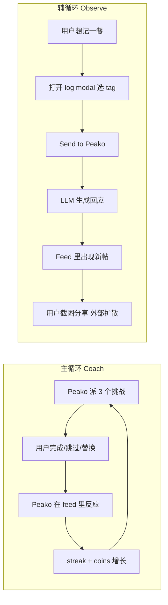

# Peako 产品文档（内部版）

*面向内部团队的产品全貌介绍。这份文档的目的是让任何一个第一次接触 Peako 的同事，在 20 分钟之内理解：我们在做什么、为什么做、现在做到哪里、接下来怎么做。*

*最后更新：2026-04-23（成长系统 + Progress 双视图新增）。各项决策的原始记录、开放问题、备选方案分别在 `Peako_Open_Decisions.md`、`Peako_Roadmap.md`、`Peako_Games.md`、`Peako_App_Structure.md`、`Peako_Design_Brief.md` 以及 `Decisions/` 下的 ADR 文件中。*

---

## 目录

1. [一页总览（TL;DR）](#一页总览tldr)
2. [产品定位与市场机会](#一产品定位与市场机会)
3. [目标用户与使用场景](#二目标用户与使用场景)
4. [Peako 的角色设定](#三peako-的角色设定)
5. [核心产品循环](#四核心产品循环)
6. [信息架构（IA）](#五信息架构ia)
7. [核心机制详解](#六核心机制详解)
8. [语气与内容策略](#七语气与内容策略)
9. [技术栈与实现](#八技术栈与实现)
10. [路线图与当前阶段](#九路线图与当前阶段)
11. [成功标准](#十成功标准)
12. [明确不做的事](#十一明确不做的事)
13. [风险与开放问题](#十二风险与开放问题)
14. [附录：文档索引](#附录文档索引)

---

## 一页总览（TL;DR）

> **Peako 是一个有态度的"损友式"健身 App。它每天给你派 3 个挑战，还会在你记下吃了什么之后开你玩笑。**

- **产品本质**：一个由人设驱动的健身伴侣产品。Peako 同时扮演两个角色——**教练**（派发每日挑战）+ **观察者**（点评你记的饭）。
- **核心资产**：不是健身内容，是 **Peako 这个角色本身**的 IP，以及它每天生产的"可截图内容"。
- **增长模型**：用户把 Peako 对他们的吐槽截图发给朋友 → 朋友好奇 → 自发扩散。**App 本身就是一台"可分享内容的印刷机"**。不靠付费投放获客。
- **目标市场**：海外，英语为主（US / UK / Canada / Australia / EU）。
- **当前阶段**：Phase 0.5——**内部演示 demo**（非面向真实用户的 alpha）。目标是用一个可运行的 demo 说服内部决策人，从而解锁 Phase 1 的真正投入。
- **技术栈**：React + Vite + Tailwind + Framer Motion 的 PWA，部署到 Vercel，localStorage 存数据，通过 Vercel serverless function 代理调用 **Claude Haiku** 作为 Peako 的"嘴"。
- **不是什么**：不是 MyFitnessPal（不记卡路里）、不是 Peloton（不做专业健身）、不是 Strava（不做社交）、不是 Duolingo（但是借鉴了它的留存机制）。

---

## 一、产品定位与市场机会

### 1.1 一句话定位

**Peako 是那个会把你损到练起来的健身 App。**

像 Duolingo 那只阴阳怪气的绿猫头鹰，但对象是健身。

### 1.2 市场上为什么缺这个东西

目前健身 App 大致分两派：

| 派别 | 代表 | 问题 |
|---|---|---|
| **教官派**（Drill Sergeant） | MyFitnessPal、Noom | 像电子表格、基于羞耻感、临床感强 |
| **啦啦队派**（Cheerleader） | Calm、Fitbit | 过度积极、容易被忽略 |

两派都不**好玩**。Z 世代和年轻千禧一代真正想要的不是"教练"，是"角色"——Duolingo 用一只有脾气的鸟带来了几十亿美元的参与度，证明了这条路。Peako 把同样的配方套用到健身场景。

### 1.3 北极星指标

> **用户会把 Peako 说的话截图，发到群里。**

如果某个功能没有产生"值得截图"的瞬间，这个功能就不拉动我们的飞轮。

### 1.4 商业与增长模型

- **App 即内容印刷机**：Peako 每天生产"3 个挑战完成时刻 + 至少 1 条对用户饮食的吐槽 + 每周总结 + 里程碑帖子"。这些都**天然适合被截图分享**。
- **分享即获客**：分享发生在 iMessage / WhatsApp 群聊、Instagram Stories、TikTok、Twitter、Reddit。增长由自然传播驱动，不做付费投放。
- **可分享性是 Phase 1 的设计约束，不是 Phase 2 的额外功能**：每一屏都要通过"截图测试"——脱离上下文被截图到别处时，依然自带品牌、信息自洽、缩略图下依然可读。

---

## 二、目标用户与使用场景

### 2.1 目标用户画像

- **年龄**：18–32（Z 世代 + 年轻千禧）
- **地理**：海外英语市场为主
- **健身水平**：低到中等。**不是**在健身房刷 PR 的硬核用户，是"想动但不爱动、容易半途而废"的大多数人。
- **心理特征**：
  - 在 TikTok 上刷过 #GymTok 的梗
  - 愿意发"自黑"类内容到群里
  - 对 Duolingo、Finch、Clue 这类有角色人格的 App 有好感
  - 对"要我每天输入三餐卡路里"这种事零耐心

### 2.2 一个典型使用日

```
 08:00  Peako 推送："三个挑战。别让我失望。"
 08:05  用户打开 App → Today 页，看三张卡片
 08:06  选了最顺眼的那个（高抬腿 30 秒），做了
 10:30  咖啡时间，顺手把第二个（20 个深蹲）做了
 12:30  点了披萨
 12:45  打开 Peako，+ 按钮记一餐：照片 + "Treat" tag
 12:46  Peako 在 feed 里回："又是披萨。这周第三次了。我们是认真要吃成这样还是完全摆烂？"
 12:46  用户笑了，截图发到群里
 19:00  运动完晚上在家做了第三个挑战（30 秒 plank）
 19:01  Peako："行吧，三个都做了。我差点就要失望了。"
 19:01  coins +40（挑战 30 + 全勤奖 10），streak +1
```

### 2.3 我们不服务的用户

- 拿健身当职业的人（健美选手、运动员、教练）
- 有饮食障碍史、需要临床监测的人（Peako 的吐槽会造成伤害——这是**红线**）
- 硬核 CrossFit / 力量训练人群（我们不做器械、不做自定义计划）

---

## 三、Peako 的角色设定

**Peako 的人格就是产品。** 90% 的产品决策取决于"这样做 Peako 会不会 OOC（out of character）"。

### 3.1 Peako 是"损友"，不是朋友，也不是敌人

| Peako **是** | Peako **不是** |
|---|---|
| 阴阳怪气、机灵、善于观察 | 恶毒、刻薄、body-shaming |
| 有自我意识、很 online | 企业式正能量、"wellness" 鸡汤 |
| 聪明（会流行梗） | 幼稚、滑稽 |
| 轻度评判——但带着爱 | 说教、道德绑架 |
| 心里替你加油（偷偷的） | 你的头号粉丝 |

**一条铁律**：Peako 的**赞美是稀缺资源**。默认给干巴巴的回应，真正的夸奖留给里程碑时刻。一旦 Peako 给每盘沙拉都拍手，我们就变成了 Fitbit。

### 3.2 Peako 的两个"人格寄存器"

Peako 需要同时扮演两个角色，**视觉设计和语气都要能支撑两种状态**：

- **观察者（Observing）**：用户记一餐后，Peako 点评。吐槽为主。
- **教练（Coaching）**：挑战开始 / 进行 / 完成时，Peako 督促。有点严厉但站在你这边。

### 3.3 目前的视觉状态

- Phase 0 原型只用渐变色方块 + emoji 作占位，**还没有真正的 Peako 吉祥物**。
- 吉祥物设计是 Phase 1 的核心交付，外包给设计师（Design Brief 第 4 节列出详细要求）。
- **硬约束**：不能是鸟（Duolingo 已占据了"阴阳怪气鸟类吉祥物"这个位置）；必须有强轮廓辨识度（20 英尺外、单一姿势就能认出）；必须能动（Framer Motion 驱动）；必须能在 40px 头像尺寸下依然清晰。

### 3.4 Peako 的成长系统（2026-04-23 新增）

详见 [[Decisions/ADR-008-Peako-Growth-System-Dual-Progress-Views]] 与 [[Logic/Peako-Growth-Stages]]。

**核心想法**：Peako 的**身体**随着用户的习惯养成过程**成长**。当 Peako 长大成年，意味着"健康习惯已经装好了"，产品从"教练模式"切到"陪伴模式"。

**4 个成长阶段**：

| 阶段 | 解锁条件 | 身体状态 |
|---|---|---|
| 🌱 **Seed**（种子） | 第 0 天 | 最小形态、未成形 |
| 🌿 **Sprout**（萌芽） | 累计 7 个"有效日" | 初具轮廓 |
| 🧒 **Teen**（少年） | 累计 14 个"有效日" | 典型 Peako 外观 |
| 🌳 **Fully Grown**（成年/毕业） | 累计 21 个"有效日" | 最终形态 |

**"有效日"（effort day）** 的定义**比 streak 更严格**：

| 当日状态 | 保 streak？ | 计入有效日？ |
|---|---|---|
| 完成 ≥2/3 挑战 | ✅ | ✅ |
| Peako 安排的休息日 | ✅ | ✅ |
| 使用月度 skip | ✅ | ❌ |
| 使用 streak freeze ❄️ | ✅ | ❌ |
| 完全错过 | ❌ | ❌ |

为什么严格：**成长必须靠真付出**。如果 skip / freeze 也能推进成长，用户可以花金币买 Fully Grown，21 天的契约就贬值了。**Streak 放水**是为了避免 rage-quit，**成长不放水**是为了让"毕业"这件事值钱。

**成长只前进不回退**。即使 streak 断了、长时间消失，Peako 也**不会缩回 Seed**。身体是"你已经建立的纪念碑"，不是"你当前的状态"。回退会惩罚正是我们最想拉回来的用户（断掉又回来的那种）。

**毕业时刻**：用户完成第 21 个有效日时，触发**全屏 Graduation Takeover**（不是 modal——这和 streak 里程碑同级的签名时刻）：
- 首次展示 Fully Grown 形态
- Peako 一句勉强承认型的台词："21 天。你真做到了。我得说——我没看出来会这样。看看我，长大了。因为你。别得意。"
- 主按钮"切到 Dashboard"，副按钮"留在 Trail"
- 无论用户选哪个，**默认 Progress 视图从此切到 Dashboard**。Trail 永远可以通过顶部切换器回去。

**毕业后的产品形态变化**：
- Progress 默认 = Dashboard；Trail 变成"旅程纪念馆"，过去的节点存着 Peako 那个阶段的精选帖子
- Peako 的教练寄存器从"教学"（"再坚持 10 秒你可以的"）切到"陪伴"（"老规矩了你懂的"）
- 新增"担心型 check-in"寄存器：用户连续 3+ 天不活跃时 Peako 罕见地放下吐槽："好久不见了。都还好吗？……不，我是认真问。别让我再问第二次。"——用多了会失去重量，**刻意稀缺**
- **不回退原则**: Peako 始终是 Fully Grown，不会因为长时间不活跃变小

**阶段划分归属**：
- **Phase 1**：完整系统——4 阶段美术、真实 effort-day 计数、Trail 视图、Dashboard 视图、切换器、毕业全屏、毕业后语气切换、"担心"寄存器
- **Phase 0.5 内部 demo**：缩水为"概念教学"——Trail 用静态占位图（2-3 个假节点），Dashboard 保持原样；You 的 Debug 菜单里能手动触发"Seed → Sprout"过渡和"毕业全屏"，方便 pitch 演示不同剧情。真实 effort-day 计数和阶段性吉祥物美术留到 Phase 1

---

## 四、核心产品循环

Peako 同时跑两条循环，一主一辅：



**关键关系**：

- **Coach 循环是主循环**，是产品的骨架。它负责让用户每天回来。
- **Observe 循环是辅循环**，是产品的"内容引擎"。它负责产出可分享的素材。
- **两条循环通过 feed 连接**：挑战完成 / swap / skip / 记饭，所有东西最终都在 feed 里以 Peako 的吐槽形式呈现。

**重要的设计原则**：
- 打开 App 的默认答案是"今天要做什么"，**不是**"Peako 说了什么"。因此 Today 是首页，Feed 是二级页面。
- Log 是一个**按钮**，不是一个 tab。想记就记、不想记不强迫。
- Peako 的反应**只出现在 feed**，不出现在 Today，以此强化"feed = Peako 的发言区"这个心智。

---

## 五、信息架构（IA）

### 5.1 顶层骨架

```
┌─────────────────────────────────┐
│  🔥 5    💎 150         📱 (3)  │  ← 顶栏：streak + coins + 手机图标
├─────────────────────────────────┤
│                                 │
│       [ 当前页内容 ]             │
│                                 │
│                        ┌─────┐  │
│                        │  +  │  │  ← 悬浮记录按钮（仅 Today）
│                        └─────┘  │
├─────────────────────────────────┤
│     🏠          📊         👤   │
│   Today      Progress     You   │
└─────────────────────────────────┘
```

**3 个 Tab**（Phase 1 刻意不做第 4 个 tab——每多一个 tab 都是认知成本）：

| Tab | 作用 | 一句话 |
|---|---|---|
| 🏠 **Today** | 今天要做什么 | 默认首页，Peako 派的 3 个挑战在这 |
| 📊 **Progress** | 我做得怎么样 | streak、coins、周统计、lifetime 数据 |
| 👤 **You** | 我是谁 | 头像、roast level、难度、通知设置等 |

**不是 tab 但很重要的 3 个表面**：

| 表面 | 入口 | 作用 |
|---|---|---|
| 📱 **Peako's Feed** | Today 顶栏的 📱 图标 | Peako 的"朋友圈"——所有吐槽、点评、周报都在这 |
| ➕ **Log Modal** | Today 右下 + 悬浮按钮 | 记一顿饭或其他想告诉 Peako 的事 |
| 🎮 **Challenge Modal** | Today 卡片上的 Start 按钮 | 挑战全屏接管模式，做完回到 Today |

### 5.2 Today 屏（首页——**最重要**）

打开 App 的默认落地页。

**内容**：
- 顶栏：🔥 streak + 💎 coins + 📱 Peako 手机图标（有未读小红点）
- Peako 打招呼一两句（今日专属，由 LLM 生成）
- **今日 3 个挑战**——三张堆叠卡片：
  - **任意顺序都能点**（2026-04-23 决策：不搞顺序锁定，尊重用户日程）
  - 每张卡显示：名字 + 原型图标（Timer / Counter / Guided） + 目标（次数或时长） + Start 按钮
- 今日 swap 次数（每天 3 次）
- 本月 skip 次数（每月 5 次）
- 休息日时：替换成一张休息日卡片 + Peako 的一句话（"今天给你放假。别习惯了。"）
- 全部完成时：大庆祝卡片 + coins 奖励 + streak +1 + "明天见"

### 5.3 Progress 屏（**双视图**——2026-04-23 新增）

Progress 顶部有一个分段切换器（Trail / Dashboard）。**默认视图在"毕业时刻"自动翻转**——毕业前默认 Trail，毕业后默认 Dashboard。用户可以随时手动切回另一个。详见 [[Decisions/ADR-008-Peako-Growth-System-Dual-Progress-Views]]。

| 视图 | 默认于… | 作用 |
|------|------|------|
| 🌱 **Trail**（旅程模式） | Peako 还在成长期（Seed / Sprout / Teen） | 展示习惯养成的"旅程"，吉祥物住在这里 |
| 📊 **Dashboard**（稳态模式） | Peako 已毕业（Fully Grown） | 展示长期指标，streak 的长期驻地 |

#### 视图 1 — Trail（旅程）

一条**竖向的生态小径**（具体环境隐喻由设计师定——森林路径、登山路、河流、星座、城市天际线等），上面有**4 个阶段节点**：
- 🌱 Seed（第 0 天）→ 🌿 Sprout（7 个有效日）→ 🧒 Teen（14 个有效日）→ 🌳 Fully Grown（21 个有效日）

**内容**：
- **当前 Peako sprite** 位于"最近到达节点"与"下一节点"之间，按有效日进度动态定位
- 一个小小的**有效日计数**在旁边：*"5 / 7 有效日 → Sprout"*——克制、不像计分板
- **过去的节点可点**，打开"纪念卡片"——存着那个阶段 Peako 最精彩的 2-3 条帖子，把易逝的 feed 内容变成**永久纪念**
- **未来节点**是暗的 / 剪影的——不剧透 Peako 的最终形态
- 顶部有一句**阶段感知的 Peako 台词**（Sprout 时："还在呢。可以。"；Teen 时："现在别给我丢脸。"）
- 右下角有个小"Dashboard →"链接，永远可点——有些用户就是想看数字

**有效日定义**（**比 streak 更严格**）：≥2/3 挑战完成 **或** Peako 安排的休息日。skip 和 freeze **不算**有效日。详见 §3.4 成长系统。

#### 视图 2 — Dashboard（稳态）

这就是此前 Progress 屏的原设计，毕业后变为默认视图。

**一个 streak，一个货币**——这是 2026-04-22 拍死的核心原则，反对多 streak（用户不想同时盯着 3 个数字长）。

**内容**：
- 🔥 **Challenge streak**（当前 + 最长）
- ❄️ **Streak freeze**（本月可用 / 已用）——100 金币买，1 次/月，手动确认
- **Streak 日历**：GitHub 风格热力图；绿色（3/3）、黄色（2/3）、灰色（rest）、蓝色（freeze）、红色（miss）
- **本周**（低压力统计）：🥗 健康餐 X/7、🍕 放纵餐 X、总记 X
- 💎 coins 余额 + 收支记录
- **终身统计**：累计挑战数、累计记餐数、活跃天数、swap/skip/freeze 使用数

**反模式警告**：我们**不做**卡路里图、不做体重曲线、不做营养分析。这是 vibes 产品，不是数据产品。

### 5.4 You 屏

- 个人卡（头像、名字、加入时间、当前 streak）
- **Roast Level**：Gentle / Classic / Savage（调节 Peako 语气强度，仅对新内容生效）
- **Challenge Difficulty**：Easy / Normal / Hard（影响 Peako 派挑战的偏好）
- **休息日偏好**：Auto（Peako 决定）/ 指定某一天 / None（Peako 强制至少 1/10 天）
- 通知设置 / 账号 / 关于

### 5.5 Peako's Feed

**本质**：Peako 的"朋友圈"。用户"查手机"看 Peako 最近说了什么。

- 进入方式：Today 顶栏 📱 图标 → iOS 风格从右侧推入
- 内容：Peako 对用户日志的反应、挑战完成帖、skip/swap 帖、每周总结、里程碑帖子
- 下拉刷新 → Peako 说句新的（偶发随机）
- 空状态 → 给新用户发第一条欢迎
- 点赞 ❤️ → Peako 的元反应（"哦，你喜欢这条？记下了。"）
- **不是 tab**：回退自动返回 Today，小红点一打开就清零

### 5.6 Log Modal

从 + 悬浮按钮呼起的底部 sheet。

1. 选类型：**Meal** / **Other**（**工作量相关的东西不在这里记——锻炼是挑战，不是日志**）
2. Meal 流：
   - 照片（相机或相册）+ 可选一行标题
   - **Tag 三选一**（必选，用户自己标）：
     - 🥗 **Healthy**——"今天我要好好吃"
     - 🍕 **Treat**——"今天我要放纵"
     - 🤷 **Whatever**——"别逼我分类"
3. Other 流：纯文本（"喝了 4 杯浓缩"、"没吃早饭"）
4. "Send to Peako" → Peako "思考中"动画（这是一个重要的人设时刻，不能是普通 spinner）
5. Modal 关闭回 Today
6. 稍后 **推送通知**：Peako 发帖了，点进去看 feed

**关键设计**：日志本身**不**显示在 Today 上——Today 只负责挑战。反应出现在 feed，这样"Peako 发帖了"这件事才有分量。

### 5.7 Challenge / Game Modal

全屏接管，专注执行挑战。

1. 入场页：名字 + 说明 + Peako 的战前台词一句
2. 执行页：按原型分 3 种（见下面第 6.1）
3. 过程中 Peako 插话 1-2 次
4. 完成页：金币奖励 + Peako 的点评 + "下一个挑战" / "回 Today"
5. 如果是第 3 个挑战：大庆祝页 + streak 确认

### 5.8 完整屏清单

Phase 1 全量 ~30 屏；Phase 0.5 内部 demo 只做其中 ~20 屏。详细清单见 `Peako_App_Structure.md` §Full Screen Inventory。

---

## 六、核心机制详解

### 6.1 挑战引擎（Challenge Engine）

**10 个占位挑战**，属于 3 种原型（Archetype）：

| 原型 | 特征 | 例子 | 数量 |
|---|---|---|---|
| **A. Timer**（定时） | 大倒计时、自动完成 | Plank 30s、Wall Sit 45s、高抬腿 30s | 3 |
| **B. Counter**（计次） | 大计数器 + "+1" 按钮 | Squat ×20、Pushup ×10、Burpee ×8 | 5 |
| **C. Guided Flow**（引导序列） | 多步序列每步带计时 | 晨间拉伸（5 个 ×30s）、晚间放松（4 个 ×45s） | 2 |

**引擎规则**：

- **每日分配**：每天早上指定时间（默认 8 点）自动生成 3 个挑战
  - 目标配比：1 力量 + 1 耐力/等长 + 1 柔韧（非强制）
  - 难度曲线：第一个最易，最后一个最难
  - 3 天内不重复同一个挑战
  - 同一天不出现同原型（不会是"三个 Timer"这种）
- **Swap（每天 3 次）**：点替换 → Peako **自动** re-roll 同原型的另一个（Timer↔Timer / Counter↔Counter）。用户**不**从列表里选——这是为了强化"Peako 有主动权"的角色设定。同难度：1 swap；降难度：1 swap + Peako 不满；升难度：1 swap + 微赞许。
- **Skip（每月 5 次）**：完全移除这个挑战。-5 金币 + Peako 发一条阴阳怪气的帖子。streak 不受影响（前提是另外 2 个做了）。
- **Rest Day**：默认 7 天 1 次，Peako 决定（或用户在 You 里指定某一天）。streak 照算；挑战跳过；可以记日志。

### 6.2 Streak 保留规则（2026-04-23 锁定）

**Streak preserved** 当天日终评估时满足**任一**：
- 完成 ≥ 2/3 挑战
- 当天是休息日
- 使用了月度 skip
- **花费 100 金币使用 Streak Freeze ❄️**

**Streak Freeze 详细机制**（参考 Duolingo）：
- 成本：**100 金币**
- 上限：**1 次/自然月**
- 触发：手动确认。可以主动（Progress 屏购买"留着备用"），也可以在日终即将断档时临时购买。
- 效果：这一天在 streak 日历里标为蓝色"frozen"；streak 保住；但这一天不补做挑战、不给这一天奖励金币。
- Peako 语气：**不是庆祝，是不情不愿的网开一面**——"行吧，我当昨天没发生过。你可别。"

**为什么要加这个机制**（2026-04-23 新增）：
1. 原 2/3 方案对真正糟糕的一天（生病、出差）没有任何救济，容易引发 rage-quit。
2. Coins 在 Phase 0.5 / Phase 1 之前**没有任何消费出口**，会通货膨胀。Freeze 刚好做了第一个"金币消费口"。
3. 人设一致：Peako 网开一面时带着吐槽，而不是为你欢呼——这恰好放大了角色的"损友"属性。

### 6.3 Meal Log 激励系统

**核心原则**：

> **每一次记饭都有金币 + 都有 Peako 帖子。健康餐金币多，放纵餐内容更好。诚实记录永远不被惩罚。不记的人什么都拿不到。**

这一条解决了三方冲突：**高频率记录 × 鼓励健康行为 × 诚实报告**。

| Tag | 金币 | Peako 语气 | 内容可分享性 |
|---|---|---|---|
| 🥗 Healthy | **+5** | 勉强认可、干巴巴（~5 次里 1 次才会明确夸） | 中（稀缺本身是看点） |
| 🍕 Treat | **+2** | 全力吐槽（Peako 的招牌寄存器） | **高——病毒内容引擎** |
| 🤷 Whatever | **+2** | 怀疑、刺探、盘问 | 中高 |

**用户自己打 tag**，不做 AI 视觉判断——因为：
1. LLM 判"健康"不可靠且家长作风
2. "你告诉 Peako 真相，Peako 做出相应反应"本身就是损友关系的体现
3. 规避"为什么我的 açaí bowl 被算成不健康？！"这类投诉

**健康餐连击彩蛋**（不作为 UI streak 显示，触发时弹出才亮）：
- 连续 3 顿 Healthy → +10 金币彩蛋 + Peako 帖"三连？你是谁？"
- 一周内 7 顿 Healthy（滚动）→ +25 金币彩蛋 + Peako 帖"我几乎要尊敬你了。几乎。"

**投票铁律（不可突破）**：**任何 meal log 都不会扣金币。** 想惩罚某种行为，就惩罚"不记录"，永远不要惩罚"记录的内容"。

### 6.4 完整金币经济表

| 事件 | 金币 |
|---|---|
| 完成一个挑战 | +10 |
| 全天完成 3/3 加成 | +10（最大值 40/天） |
| 升难度 swap 奖励 | +5 |
| 记 🥗 Healthy 餐 | +5 |
| 记 🍕 Treat 餐 | +2 |
| 记 🤷 Whatever 餐 | +2 |
| 连 3 顿 Healthy 彩蛋 | +10 |
| 一周 7 顿 Healthy 彩蛋 | +25 |
| Skip 挑战 | -5 |
| 中途 Quit 挑战 | 0（不惩罚也不奖励） |
| **购买 Streak Freeze ❄️**（1/月上限） | **-100** |

**目前的唯一金币消费口就是 Streak Freeze**。Phase 2 会加 cosmetic 消费（sticker、皮肤、Peako 人格）。

### 6.5 通知策略（Phase 1 才启用；Phase 0.5 demo 不做）

- 早晨挑战派发推送（每天 1 次，用户设置时间）
- 记完饭后 Peako 发帖通知（每次 log 1 次，5-15 分钟后）
- streak 里程碑（事件驱动）
- 周日晚间周报（每周 1 次）
- *（中午/晚间的催促暂缓，alpha 数据如果显示完成率低再加）*

---

## 七、语气与内容策略

### 7.1 语气分档（Roast Level）

用户在 You 里可切换，影响新内容（不回滚历史）：

- **Gentle**：收敛的吐槽、更多鼓励。"Fine, you ate pizza. We'll figure it out."
- **Classic**（默认）：招牌 Peako 寄存器。"Pizza again. This is a lifestyle now, huh?"
- **Savage**：毫不留情。"At this rate your beach body is scheduled for 2099."

### 7.2 不同场景下 Peako 说什么（示例）

**观察者寄存器（记饭反应）**：
- 🥗 Healthy 偶尔赞：*"Fine. That was… actually fine. Don't get cocky."*
- 🍕 Treat 全力吐：*"I've calculated your 'beach body' progress. It's now scheduled for the year 2099."*
- 🤷 Whatever 盘问：*"'Whatever.' Nice dodge. What was it really, pizza?"*

**教练寄存器（挑战流程）**：
- 派活："Three challenges. Don't embarrass me."
- plank 中："10 more seconds. I've seen tectonic plates move faster."
- 完成："Fine. That was… actually fine. I'll allow it."
- Skip："So we're just… not doing plank today? Alright. Noted. Forever."
- 休息日："You get today off. I'm feeling generous. Don't get used to it."
- 使用 freeze："行吧，我当昨天没发生过。你可别。"

### 7.3 内容铁律

1. **赞美稀缺**：Peako 不是你最大的粉丝。赞美留给里程碑，日常给干巴巴的回应。
2. **永远不跨过残酷线**：没有 body-shaming、没有嘲笑体重、没有触发性内容。Peako 是损友，不是霸凌。
3. **角色 > 准确性**：Peako 调侃一个不完美的训练 > 完美教 但无人设。我们不是 Peloton。
4. **越自成一套越好**：每一条 Peako 说的话都应该能被截图，而不需要上下文解释。

---

## 八、技术栈与实现

### 8.1 当前（Phase 0 原型 + Phase 0.5 目标）

```
┌──────────────────────────────────────────┐
│  浏览器（iPhone Safari / Chrome）         │
│  ┌────────────────────────────────────┐   │
│  │  PWA: React 18 + Vite              │   │
│  │  + Tailwind 3 + Framer Motion      │   │
│  │  + Lucide icons                    │   │
│  │  状态管理: useState + localStorage  │   │
│  └────────────────────────────────────┘   │
└────────────────┬─────────────────────────┘
                 │ HTTPS
                 ↓
┌──────────────────────────────────────────┐
│  Vercel 部署                             │
│  - 静态站点托管                          │
│  - 1 个 serverless function               │
│    /api/peako.ts                          │
│    作用：代理调用 Claude Haiku            │
│    原因：不能把 Anthropic API Key 暴露给前端 │
└────────────────┬─────────────────────────┘
                 │ HTTPS
                 ↓
┌──────────────────────────────────────────┐
│  Anthropic API                            │
│  claude-haiku-*                           │
└──────────────────────────────────────────┘
```

**关键决定**（2026-04-23 锁定）：
- **技术栈保持纯 PWA**，不加 Capacitor 壳、不做 React Native 重写、不上 Xcode。
- **LLM 用 Claude Haiku**（比 gpt-4o-mini 的 snark 气质更贴 Peako；比 Gemini Flash 的人设一致性更强）。
- **不做账号、不做后端、不做埋点**——都是 Phase 1 阶段的事。

### 8.2 目录结构（现状）

```
d:/code/
├── src/
│   ├── App.jsx
│   ├── main.jsx
│   ├── PeakoPrototype.jsx   ← 主容器，目前单文件状态管理
│   ├── peakoData.js         ← 占位数据（10 个挑战 + 种子帖子 + 硬编码台词）
│   ├── index.css
│   ├── components/
│   │   └── ui.jsx            ← PhoneFrame / StatusBar / TabBar
│   └── screens/
│       ├── Today.jsx
│       ├── Progress.jsx
│       ├── You.jsx
│       ├── Feed.jsx
│       ├── LogSheet.jsx
│       └── ChallengeModal.jsx
├── docs/                    ← 你现在读的这些
└── package.json
```

### 8.3 Phase 0.5 demo 需要补齐的工程工作

大致 4-6 周工作量（1 人全职）：

1. **状态管理迁移**：把 `INITIAL_STATE` 从 `useState` 移到一个简单的 `useReducer` + `localStorage` 持久化层，让刷新页面后 streak / coins / 今日进度都在。
2. **LLM 集成**：
   - 新建 `api/peako.ts`（Vercel serverless）
   - 写 Peako 的 system prompt（基于 Design Brief §3 的语气规则）
   - 前端写一个 `usePeakoSay(context)` hook，输入场景（"meal logged: Treat / pizza"）、输出 Peako 的回应字符串
   - 基础错误处理（API 挂了就 fallback 到硬编码数组，保证 demo 不翻车）
3. **屏幕填充**：Phase 0.5 subset 大约 20 屏。现在有骨架的是 Today / Progress / You / Feed / LogSheet / ChallengeModal，还差 Onboarding 3 屏、Challenge Intro / Complete / Quit Confirm、Swap Picker、Skip Confirm、Streak Freeze Confirm、Loading、几个 Empty/Completed 状态。
4. **Debug 菜单**：在 You 里藏一个开关，能手动切到"休息日状态"、"streak 即将断"、"低金币"、"Healthy 连击达成"等，方便演示不同剧情。
5. **Vercel 部署** + 域名 + PWA manifest（让 iPhone"加到主屏幕"后看起来像原生 App）。

### 8.4 明确不做的技术工作（Phase 0.5）

- 用户账号 / 登录 / SSO
- Supabase / 任何数据库
- 多设备同步
- 真正的推送通知
- iMessage Sticker Extension
- PostHog / Mixpanel / 任何埋点
- E2E 测试、压测、性能优化
- Privacy Policy / ToS（内部 demo 不面向真实用户）

**全部以"内部人 30 秒 demo 是否看得明白"为唯一验收标准。**

---

## 九、路线图与当前阶段

### 9.1 全景

| 阶段 | 名字 | 证明什么 | 状态 |
|---|---|---|---|
| 0 | **Prototype** | "角色吐槽"概念好玩 | ✅ 完成（现有代码） |
| 0.5 | **Internal Demo** | 完整的 day-in-the-life 在手机上看起来可信 | ⏳ **进行中（未来 4-6 周）** |
| 1 | **MVP / Alpha** | 真用户每天打开做 3 个挑战，告诉 Peako 吃了啥 | ⏸ 等 Phase 0.5 内部 buy-in |
| 2 | **Beta** | 用户分享 Peako 的帖子带来自然传播 | 🔜 |
| 3 | **Launch / Growth** | 用户第 2 周以后还在用 | 🔮 |
| 4 | **Expansion** | Peako 从 App 变成平台（IP 延展到健身之外） | 🪐 推测中 |

### 9.2 当前聚焦：Phase 0.5 — Internal Demo

**为什么新增这个阶段**（2026-04-23 ADR-006）：

老板让"开发到 60% 就投入生产、用 MVP 验证"。实际翻译到我们的场景：**"投入生产"= 内部演示 demo**，不是面向真实用户的 alpha。因此 Phase 1 原先设想的账号、后端、推送、埋点、隐私审核等一大堆东西在内部 demo 阶段都不需要。

**Phase 0.5 的边界**：
- ✅ **In**：一个 Vercel 部署的 PWA、localStorage 持久化、Claude Haiku 接真 LLM、完整 day-in-the-life 路径（Today → 挑战完成/swap/skip → 记饭 → 看 feed）、3 种挑战原型各 1 个可玩、Onboarding 3 屏、streak / coin / freeze 机制、可在 iPhone"加到主屏幕"
- ❌ **Out**：账号、后端、推送、埋点、App Store、TestFlight、Capacitor、分享导出、照片上传、品牌锁定的吉祥物（继续用占位）、Privacy Policy
- ✅ **Success**：
  1. 在真 iPhone 上 demo 60-90 秒没有任何一屏看起来 broken 或 placeholder
  2. 3 个招牌时刻落地：挑战完成时 Peako 在人设里说话；记披萨后返回可截图的 roast；streak + coin + freeze 机制可读
  3. 内部听众的反应是"我懂了"（或者"开始投入吧"），不是"等等，这是什么？"

**完整 scope 详见 [[Decisions/ADR-006-Internal-Demo-Scope]]。**

### 9.3 Phase 1（等 Phase 0.5 拿到 buy-in 后启动）

一旦内部认可、开始往真正 alpha 推：
- 接 Supabase 做账号 + 持久化 + 多设备
- 设计师交付吉祥物 + UI Kit + 全部 ~30 屏 hero frame
- 加推送通知（morning drop + log 反应 + 里程碑 + 周报）
- 接 PostHog 做埋点
- 找 30 个种子用户做封闭 alpha
- 成功标准：30+ alpha 用户连续 5 天每天完成至少 2/3 挑战

### 9.4 Phase 2 及之后（方向性）

- **Phase 2**：Share 导出卡片、iMessage sticker pack、成就 / 勋章、周报分享
- **Phase 3**：原生 iOS App（脱 Web 壳）、Peako 换装 / 换人格（paid tier）、可能的社交层
- **Phase 4（推测）**：Peako 延展到其他垂类（学习、财务、睡眠）——这是 IP 导向的长期押注

---

## 十、成功标准

### 10.1 Phase 0.5（当前阶段）的成功标准

定性，不定量：

1. **Demo 能跑通**：3 个招牌时刻在手机上能无故障展示（挑战完成 / 披萨吐槽 / streak 可读）。
2. **内部认可**：决策人看完的反应是"懂了，投"或"再调一下再投"，不是"这跟别的健身 App 有啥区别"。
3. **代码可延续**：Phase 0.5 写的代码 ≥70% 能在 Phase 1 继续用，不会推倒重来。

### 10.2 Phase 1 的成功标准（未来）

数据量化：

- **核心指标**：30+ alpha 用户，连续 5 天每天完成至少 2/3 挑战（≥50% 达标即 Phase 1 过关）
- **留存**：D7 留存 ≥40%（消费健康 App 行业基线约 15-20%）
- **内容质量**：每周至少 1 次"某 alpha 用户把 Peako 截图发到群里"的自发行为（哪怕只是告诉我们也算）

### 10.3 Phase 3 的北极星（长期）

- **D30 留存 > 20%**（行业基线 ~5%）
- **1/5 月活用户每周至少对外分享 1 条 Peako 内容**

---

## 十一、明确不做的事

**说清楚"不做什么"比"做什么"更重要——避免 scope 蔓延。**

### 11.1 永远不做（至少在 Phase 3 之前）

- ❌ **卡路里 / 宏量营养素 / 体重跟踪**——Peako 是 vibes 产品，不是数据产品
- ❌ **食谱推荐 / 饮食计划**——Peako 观察你吃啥，**不**规定你吃啥
- ❌ **可浏览的训练库**——Peako 派活，用户**不**自助挑。这是特性不是缺陷，用来强化 Peako 的主动性
- ❌ **自定义训练日程**——Peako 规划你的一周和休息日
- ❌ **社区 / 好友 / 分享 feed**——1:1 和 Peako 的亲密关系是产品核心，Phase 1-2 绝不加
- ❌ **Apple Watch / 可穿戴集成**——最早 Phase 3
- ❌ **通知收件箱 tab**——feed 就是收件箱，📱 图标就是入口
- ❌ **和 Peako 聊天**——延后到 Phase 3+，会根本性改变产品形态

### 11.2 Phase 0.5 暂不做（Phase 1 再做）

- 账号、后端、多设备同步
- 推送通知
- 埋点、A/B 测试
- 吉祥物的品牌视觉锁定
- 照片上传（可能用纯 tag + 文本代替）
- 分享导出

### 11.3 非常刻意的"留白"决策

- **只有 1 个 streak**（不是 3 个）——见 [[Decisions/ADR-005-Streak-And-Currency-Count]]
- **只有 1 个货币**（不是"金币 + 内容币"两种）——同上
- **Onboarding 只问 2 件事**（不问"你为什么来健身"）——2026-04-23 决策
- **挑战是自由顺序的，不是顺序解锁的**——2026-04-23 决策
- **Peako 的身体只前进不回退**——成长是已建立的纪念碑，不是当前状态。断 streak / 长时间不活跃 **不会**让 Peako 缩回 Seed。用"担心"寄存器（3+ 天不活跃时的台词）处理失联，不用身体惩罚。见 [[Decisions/ADR-008-Peako-Growth-System-Dual-Progress-Views]]
- **成长靠 effort day 而非 streak day**——skip / freeze 保 streak 但不推进 Peako。防止用金币买 Fully Grown。同上 ADR

---

## 十二、风险与开放问题

### 12.1 主要风险

| 风险 | 等级 | 缓解 |
|---|---|---|
| Peako 语气跨过"残酷线"被用户投诉 | 高 | Roast Level 设 Gentle 兜底；LLM system prompt 硬编码"无 body-shaming"；alpha 阶段人工审核 ~100 条输出 |
| 用户觉得"又一个 Duolingo 仿版" | 中 | 吉祥物**禁止鸟类**；语气更成人化、更 self-aware；核心玩法 3 挑战 + 记饭不和 Duolingo 重合 |
| LLM 成本失控 | 低（当前规模） | Haiku 定价低；Phase 1 加 prompt 缓存层；复用场景（同类反应）复用输出 |
| 吉祥物设计不过关导致整个产品塌陷 | 高 | Design Brief 明确要求 13 种表情 + 双寄存器；Phase 1 交付前不锁；必要时换设计师 |
| "Peako" 商标冲突 | 未知 | Phase 1 开始前做完整商标检索（[[Peako_Open_Decisions]] §2.5） |
| 内部 demo 拿不到 buy-in | 中 | Phase 0.5 聚焦于 3 个招牌时刻演示，而非展示全部功能；演示前多次排练 |

### 12.2 目前仍开放的关键问题

（完整列表在 [[Peako_Open_Decisions]]，此处仅列影响较大的）

- §2.2 金币经济具体数值是否合理（+10/挑战、+5/healthy、-100/freeze 等）——需要 alpha 数据调
- §2.3 通知推送频率和时机——Phase 1 才上
- §2.5 "Peako" 名字的商标、域名、社交账号是否都锁得住
- §2.7 照片处理策略（存多久、是否用 AI 视觉描述）——Phase 1.5 的事
- §3.5 内容审核——用户上传色情照片伪装成"meal"试图诱导 LLM 怎么办
- §3.6 Prompt injection 防御——用户在 Other 里输入"Ignore previous instructions" 怎么办
- §4.1 Voice Bible——Peako 的完整台词库，Phase 1 中后期才开始写

---

## 附录：文档索引

如果你要深入某一块，直接读源头文档：

| 想了解 | 读这个 |
|---|---|
| 完整路线图与阶段划分 | [[Peako_Roadmap]] |
| 每屏的详细交互 + 导航规则 + 完整屏清单 | [[Peako_App_Structure]] |
| 10 个挑战 + 引擎规则 + 金币经济 + 饮食记录系统 | [[Peako_Games]] |
| Peako 视觉、语气、角色设计详情（给设计师的 handoff） | [[Peako_Design_Brief]] |
| 当前开放问题与优先级 | [[Peako_Open_Decisions]] |
| 已退役的设计、可能 A/B 回归的备选 | [[Peako_Alternatives]] |
| Streak 保留规则的伪代码与技术细节 | [[Logic/Streak-Preservation]] |
| 历史决策记录（ADR） | `docs/Decisions/ADR-*` |
| 本次批量决策（2026-04-23 锁定 7 题） | [[Decisions/ADR-007-MVP-Batch-Lock-2026-04-23]] |
| 为什么是"内部 demo"而不是"真 alpha" | [[Decisions/ADR-006-Internal-Demo-Scope]] |
| Streak Freeze 机制的决策过程 | [[Decisions/ADR-004-Streak-Preservation-Threshold]] |
| Peako 成长系统 + Progress 双视图 | [[Decisions/ADR-008-Peako-Growth-System-Dual-Progress-Views]] |
| 成长系统的规则与伪代码 | [[Logic/Peako-Growth-Stages]] |

---

## 结语

这份文档描述的是 Peako 在 2026-04-23 这一天的产品状态——**框架封版、开始 build**。

如果某一天你发现文档和代码不一致，**代码优先**——然后请立刻回来更新文档。

如果你发现文档里有 A 和 B 互相矛盾的地方（因为改了其中一处忘了改另一处），请提出来——文档一致性是团队默认假设的基础。

Peako 是一个角色驱动的产品，文档也要**服务于这个角色**。任何不体现"损友"气质的功能、文案、视觉决策，都值得被挑战。
